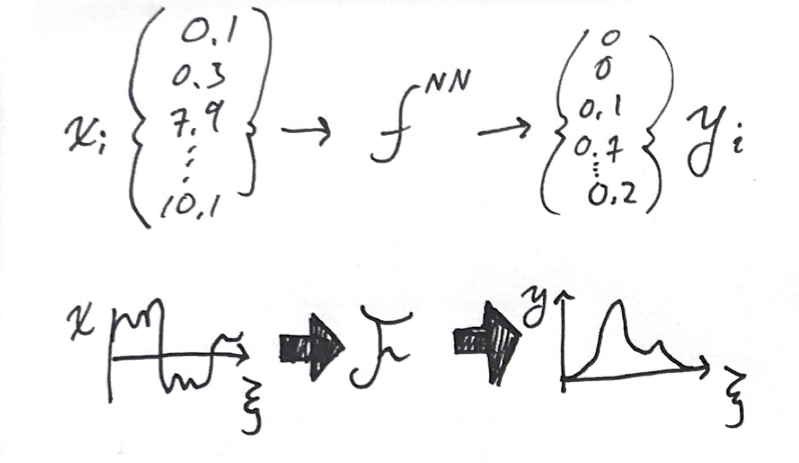
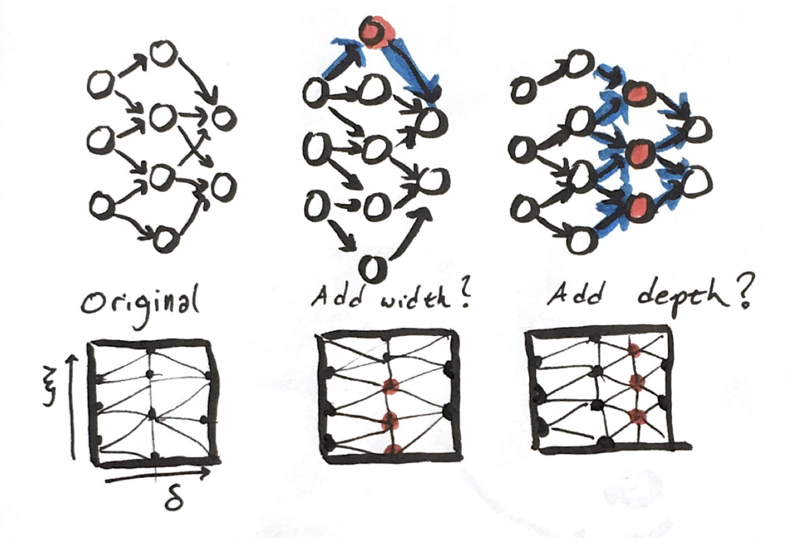
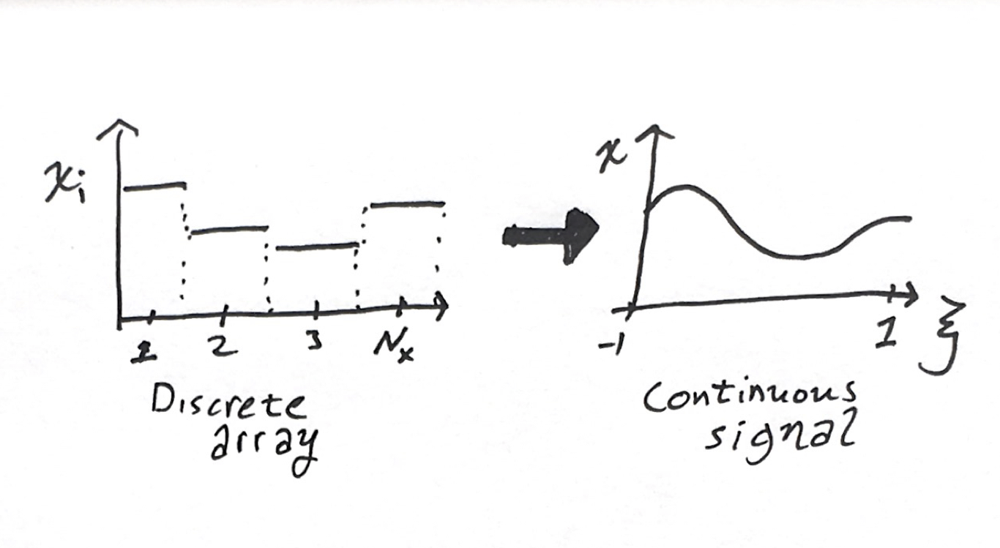
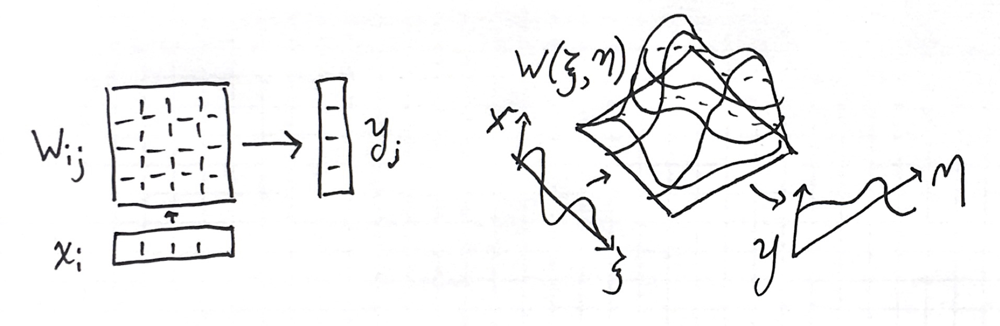
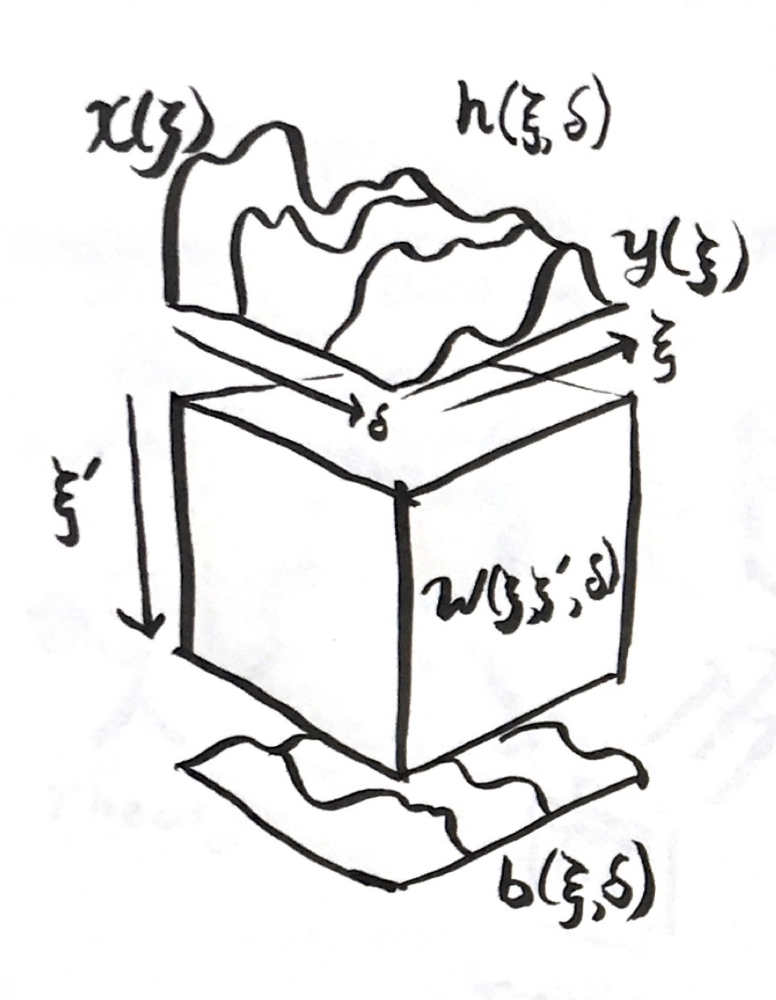

A classical neural network is just a function $f$ that takes in an array of inputs, $x_i$, and yields an output array, $y_j$. The input and output usually have different lengths, $N_x$ and $N_y$ (e.g., 784 and 10 respectively for MNIST.) It is formed of the nested discrete operations,
$$
y_j = f^{NN}(x_i)=f^D(...f^2(W^2 f^1(W^1x+b^1)+b^2)...+b^D)
$$
where $D$ is the number of layers, and $f^l$, $W^l$, and $b^l$ are activation functions, weight matrices, and bias vectors for every layer $l$. These layered operations produce a set of intermediate results known as the hidden layers. We can think of the neural network as having intermediate steps,
$$
x_i\rightarrow h^1_i \rightarrow h^2_i\rightarrow...h^D_i\rightarrow y_i
$$
where each hidden layer is the result of the operation $h^{d+1}=f^d(W^dh^d+b^d)$.

I want to make this continuous. How do we describe an arbitrary functional
$$
y(\xi) = \mathcal{F}x(\xi)
$$
where the input is a function with a domain, and the output is also function? I'll do this by making analogies from the discrete operations in a multilayer perceptron to continuous operations.

What we will end up with is an integro-differential equation that describes a "neural continuum." The linear operations along the width of each layer will be replaced by an integral along a signal space, and the nested applications will be replaced by integrating a differential equation in a depth direction.

## Why?

What bothers me the most about deep learning today is the lack of convergence proofs. If you throw more parameters at a problem, there is no guarantee that it will do better than the smaller model.

How do we compare two incrementally different model architectures? 

## Arrays to Signals

The basic element of a neural network calculation is the array of activations. (I'll be saying "Array" instead of "Tensor".) Let $N_l$ denote the width of this layer $l$. At each layer, there is an $N_l$ array of hidden values 
$$
\mathbf{h}^l=\{h_1,h_2,...h_N\}
$$
In convolutional networks, sometimes these arrays are 2D, 3D, or higher carrying some sort of spatio-temporal-channel meaning. Then, $\mathbf{h}$ has multiple indices in a grid layout, which can be indexed as $h^l_{ijkc}$ for a four dimensional example with $N_x\times N_y \times N_z \times N_c$ dimension.

Consider now a one dimensional function that maps from some nominal domain onto the reals
$$
h(\xi) : [-1,1]\rightarrow\mathbb{R}
$$
we can have higher dimensional input fields with higher dimensional outputs, e.g., 
$$
h(\xi,\eta,\omega):[-1,1]\times[-1,1]\times[-1,1]\rightarrow \mathbb{R}^c
$$
for a three dimensional field with $c$ channels at each point. (The domain $[-1,1]$ was an arbitrary choice, but if we picked any other domain, we'd probably end up mapping back to $[-1,1]$ for other steps later. E.g., common basis sets and Gaussian integration weights are defined on this domain.)

Let us now choose to interpret our array of hidden activations as coefficients to a 

These numbers don't *necessarily* have any order applied in their meaning. For example, in NLP applications the indices refer to entries in the lexicon, whose order is arbitrary. But, for a lot of applications there is a spatiotemporal interpretation with images or audio signals, for example. I don't think this line of reasoning is restricted to such applications.

## Linear Operations to Continuous Convolutions

The linear step 
$$
\mathbf{y}=\mathbf{W}\mathbf{x}+\mathbf{b}
$$

The operation is expressed in summation notation explicitly by,
$$
y_i = \sum_{j=1}^{N_d} W_{ij} x_j + b_i
$$
A 2D array is just one possible representation of a linear operator. As we did above, we can represent the weight matrix as a 2D function,
$$
W(\xi,\eta) = [-1,1]\times[-1,1] \rightarrow \mathbb{R}
$$

$$
y(\xi)=\int_{-1}^1W^d(\xi,\eta)x(\eta)\mathrm{d}\eta+b^d(\xi)
$$

We can illustrate the analogy as so:

## Composition to Integration

The secret to neural networks is the composition of functions,
$$
y = (f^{N_d} \circ f^{N_d-1}... \circ f^2...f^1)(x),
$$
(where we've tucked the $W+b$ operations into $f$ for this section.)

Let's define the analogy to a summation operator for composition,
$$
\mathop{\Large\bigcirc}_{d=1}^{N}f^{d}=f^{N}\circ f^{N-1}...\circ f^{2}\circ f^{1}
$$
where $\bigcirc$ means repeated composition over a list of unknowns. (In Flux.jl, the  `Chain` function implements $\bigcirc$.) We can then write our definition of a basic multilayer perceptron as
$$
f^{NN}=\mathop{\Large\bigcirc}_{d=1}^{N}f^{d}\circ\left(x\mapsto\mathbf{W}^dx+\mathbf{b}^d\right)
$$
where I wrote an anonymous function for the linear operator. 

Just like we did with summation, I want to turn composition into a continuous operation. For that, we need to define a gradual function application. 

 The input and output from each of these discrete steps forms a list of functions,
$$
x(\xi),\, h^1(\xi),\,h^2(\xi),\,...h^{N_d}(\xi),\,y(\xi)
$$
For the individual signal slices, we turned an array with indices $i\in[1…N_d]$ into a function $\xi^l\in[-1,1]$. Let us decide that the domains and ranges for every function in this list are the same. Let's now make a new transformation from this list of functions indexed by $d\in[1…N^d]$ to a new depth signal direction $\delta\in[0,1]$. Now we have a 2D function
$$
h(\xi,\delta):\underbrace{[-1,1]}_{\text{width}}\times\underbrace{[0,1]}_{\text{depth}}\rightarrow\mathbb{R}
$$
 where we defined $h(\xi,0)=x(\xi)$ and $h(\xi,1)=y(\xi)$. Suppose the original layers of the discrete network be spaced out by a uniform $\Delta=1/(N_d+1)$ in this depth direction in our continuous analogue. In the discrete form of the network, the way we get from one layer indexed by $i$ to next indexed by $i+1$ is
$$
h(\delta=\Delta \times (i+1))=f^i(h(\delta=\Delta\times i))
$$
Between two layers, starting at $\delta=\Delta i$, the difference in $h$ is
$$
\begin{align}
h(\delta+\Delta)-h(\delta) = & f(h(\delta))-h(\delta)\\
= & \int_\delta^{\delta+\Delta} \frac{\mathrm{d} h(t)}{\mathrm{d}t}\mathrm{d}t
\end{align}
$$
where $t$ is a dummy variable of integration. 

$$
h(\delta+\Delta)=h(\delta)+\int_\delta^{\delta+\Delta} \frac{\mathrm{d}h}{\mathrm{d}\delta} \mathrm{d} \delta' = f(h(\delta))
$$

$$
\int_\delta^{\delta+\Delta} \frac{\mathrm{d}h}{\mathrm{d}\delta} \mathrm{d} \delta' = f(h(\delta))-h(\delta)
$$

In the original discrete network, each layer is a discrete operation forwards. That begs us to use a Forward Euler approximation to this integral,
$$
\Delta \left. \frac{\mathrm{d}h}{\mathrm{d}\delta} \right|_\delta = f(h(\delta))-h(\delta)
$$
or,

$$
\frac{\mathrm{d}h}{\mathrm{d}\delta} = \frac{f(h(\delta))-h(\delta)}{\Delta}
$$

which gives us a differential equation for $h$ along the depth direction $\delta$.We can solve it with any integrator, not just Forward Euler. Forward Euler is just how we make the analogy to the feed forward discrete network. $\Delta$ is a constant that is smaller than the total length of the domain in $\Delta$ and scales the rate of the discrete activation functions $f$.

We don't have to use $f$, either. We can define an arbitrary continuous activation function $\gamma$ which corresponds to a particular discrete function with the above equation. 

## The Neural Continua Integro-Differential Equation

Piecing together the above continuous analogues from the individual operations in a discrete neural network, we derive the following integrodifferential equation
$$
\frac{\partial}{\partial \delta} h(\xi,\delta)= \gamma\left(\int_{-1}^1
 W(\xi,\xi',\delta)h(\xi',\delta)\mathrm{d}\xi'+b(\xi,\delta) \right)
$$
where $\gamma(x)=(f(x)-x)/\Delta$, subject to the initial condition 
$$
h(\xi,0)=x(0).
$$
After solving this equation, the output of the network is :
$$
y(\xi)=h(\xi,1)
$$
The network $\mathcal{F}$ is defined by the selection of nonlinearity $\gamma$, 3D weight field $W(\xi,\eta,\delta)$, and 2D bias field $b(\xi,\delta$). There is no discrete choice of layer widths or network depth.

## Training

We can define a loss function between the label signal and solution of the network by integrating over the signal,
$$
L(y,y^*)=\int_{-1}^{1}
\left(y(\xi)-y^*(\xi)\right)^2\mathrm{d}\xi
$$

The optimization problem involves searching for *functions* $W(\xi,\eta,\delta)$ and $b(\xi,\delta)$ that minimize the integral loss,
$$
\min_{W,b} \sum_{i=1}^{N_{train}} L(y^i,\mathcal{F}x^i)
$$
This may seem more complicated, but inverting on the coefficients to fields in partial differential equations is a well studied field. This problem looks a lot like the full waveform inversion problem in geological prospecting, wherein we're solving for material properties such as elastic bulk modulus $K(x,y,z)$ and density $\rho(x,y,z)$ subject to acoustic datasets paired with sources, $hammer(t)$ and $f(x_{microphone},t)$.

## Discretization

We need to perform two discretizations to be able to solve this system: 1) signal-depth-space discretization of the fields, and 2) discretization of the integration across $\delta$ to evolve as a discrete loop.

The first of these harkens back to the beginning of this discussion. We need to represent a continuous function as a set of numbers in memory on our computer. We can choose to represent functions as linear combinations of functions from discrete spaces, where we need 3D functions for $W$ to produce a discrete $\hat{W}$,
$$
\hat{W}(\xi,\eta,\delta)=\sum_i w_i \phi_i(\xi,\eta,\delta)
$$
and 3D functions for $b$ to produce a discrete $\hat{b}$,
$$
\hat{b}(\xi,\delta)=\sum_i b_i\psi(\beta,\delta)
$$
We can recover the original specification by having 3-way piecewise constant discretizations in $\xi,\eta$, and $\delta$.  We could slice in $\delta$ first, to define our layers, then pick different piecewise supports for each of these $\delta$s to have weight matrices with different dimensions. (The original discrete neural networks are just nonlinear versions of this—but let's not make this manuscript recursive!) 

My intuition suggests using spectral shape functions along $\xi$ and $\xi'$, and using compact shape functions along $\delta$. I suspect orthogonality along $\xi$ might be problematic.

The integration along the depth can be handled by any ordinary differential equation integrator. We used Forward Euler to make the correspondence, but we could use higher order or implicit solvers. It will make a distinction when doing the backwards propagation of the output of the network. The full domain support of the integral convolution ($\int W h \mathrm{d}\xi'$) could make the integration in depth-time tricky to do efficiently.

## Multiple Representations of the Same Model

The discrete gives us a way to transform between one "width-depth" discretization to another by projecting between the four meshes ($\hat{W},\hat{b}\rightarrow \hat{W}',\hat{b}'$). Suppose we had trained one network $\mathcal{F}$, and decide we want more discretization in the depth or width. We can create a new mesh that's finer, and then project to the new unknowns,
$$
\min_{w'_i} \int_{0}^1\int_{-1}^1\int_{-1}^1 \left( 
\sum_{i=1}^N\left( w_i\phi_i\right)-\sum_{i=1}^{N'}\left( w'_i\phi'_i\right) \right)^2\mathrm{d}\xi'\mathrm{d}\eta\mathrm{d}\delta
$$
This yields a linear projection operation which is common in finite element and spectral methods. 

## What to do with this?

I never implemented this idea because it seemed like a lot of effort. I originally had the variational calculus interpretation of models as a function we're trying to approximate. That perspective makes us look for better abstract representations of functions and function spaces to figure out more clever ways to  Lately, I've been leaning towards the discrete program interpretations of models, wherein we're directly synthesizing and learning *computer programs* with floating point variables and a listing of instructions `fmul`s, `fadd`s, `goto`s, etc. A few new developments made me flip back to these pages in my notebook and start thinking about mathematically solving for continuous functions again.

The [Neural Ordinary Differential Equation](https://arxiv.org/abs/1806.07366) at NeurIPS uses this kind of idea in the depth. [The Julia implementation](https://github.com/JuliaDiffEq/DiffEqFlux.jl) using [Flux.jl ](https://github.com/FluxML/Flux.jl) shows that it could possibly be implemented very easily. The work of [Chang et. al](https://arxiv.org/abs/1710.10348) used a similar ODE interpretation of residual networks, and pushed it further to develop a multigrid-in-time technique for accelerated training. (I really like this; it uses the concept of smooth refinement of an approximation, and the multigrid method is great algorithm.) They present a similar equation to $\mathrm{d}h/\mathrm{d}\delta=(f(h)-h)/\Delta$ specific for residual networks where $f=G(h)+h$. The formulation I developed here includes a simultaneous continuum-ization of the width of the network that can applied to more than residual networks.

Learning more about full waveform inversion (I credit talking to Russell J. Hewett and following his course for [PySit]()) made me realize that the optimizing for fields like $W$ or $b$ is well studied and not completely intractable.

Today (when I wrote up most of this) I attended a talk on [group equivarent convolutional networks](https://arxiv.org/abs/1902.04615) by [Taco Cohen](https://tacocohen.wordpress.com) which was deriving the discrete model using differential geometry from the perspective of continuous functions obeying symmetries. This approach is actually phrasing the hidden layers as continuous fields and designing layers that obey properties on the fields, before discretizing the operators.

Hopefully this presentation helps interpret new developments in continuous models. I would want to find a problem with 1D functions as inputs to actually implement this exact idea—perhaps audio signals.

## Reference

- Chen, Tian Qi, Yulia Rubanova, Jesse Bettencourt, and David K. Duvenaud. “Neural Ordinary Differential Equations.” *CoRR* abs/1806.07366 (2018). [http://arxiv.org/abs/1806.07366](http://arxiv.org/abs/1806.07366)

- Chang, Bo, Lili Meng, Eldad Haber, Frederick Tung, and David Begert. “Multi-Level Residual Networks from Dynamical Systems View.” *ArXiv Preprint ArXiv:1710.10348*, 2017.
- Cohen, Taco S., Maurice Weiler, Berkay Kicanaoglu, and Max Welling. “Gauge Equivariant Convolutional Networks and the Icosahedral CNN.” *CoRR* abs/1902.04615 (2019). [http://arxiv.org/abs/1902.04615](http://arxiv.org/abs/1902.04615).

